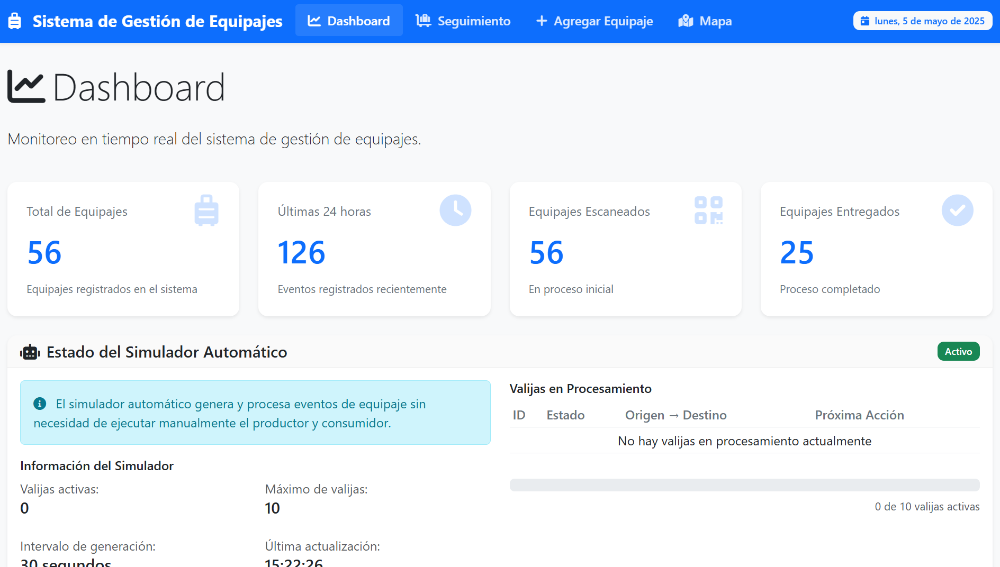

# Sistema de Gestión de Equipajes

Un sistema web responsivo para la gestión y seguimiento de equipajes en tiempo real para aeropuertos y aerolíneas.

**🌐 [Acceder al sistema en vivo](https://fedeegea.pythonanywhere.com/)**



## Características

- 📊 **Dashboard en tiempo real**: Visualiza estadísticas y métricas principales de los equipajes en el sistema.
- 🧳 **Seguimiento de equipajes**: Monitorea el estado actual e historial de cada equipaje.
- 🗺️ **Visualización en mapa**: Ubica los equipajes en un mapa según su estado y ubicación.
- ➕ **Registro manual**: Permite agregar equipajes y eventos manualmente.
- 🤖 **Simulador automático**: Genera y procesa eventos de equipaje de forma automática.
- 📱 **Diseño responsivo**: Funciona perfectamente en dispositivos móviles y de escritorio.
- 🌍 **Zona horaria local**: Muestra todas las fechas y horas en la zona horaria de Argentina.

## Tecnologías utilizadas

- **Backend**: Flask (Python)
- **Frontend**: HTML5, CSS3, JavaScript, Bootstrap 5
- **Base de datos**: SQLite
- **Visualización**: Chart.js, Leaflet.js
- **Simulación**: Hilos (threading) de Python
- **Arquitectura**: Modelo-Vista-Controlador (MVC)

## Arquitectura del Sistema

El proyecto sigue una arquitectura Modelo-Vista-Controlador (MVC) con:

- **Modelo**: Servicios de base de datos encapsulados en `src/core/db_service.py`.
- **Vista**: Plantillas HTML en `templates/`.
- **Controlador**: Rutas API en `src/api/routes.py` y rutas web en `app.py`.

Además, se implementa:
- **Inyección de dependencias**: Para facilitar el testing y la modularidad.
- **Separación de responsabilidades**: Cada módulo tiene una única función.
- **Configuración centralizada**: En `src/core/config.py`.

## Instalación

### Prerrequisitos

- Python 3.8 o superior
- pip (gestor de paquetes de Python)

### Pasos de instalación

1. Clona este repositorio:

```bash
git clone https://github.com/fedeegea/ArqApp-03.git
cd ArqApp-03
```

2. Crea un entorno virtual (opcional pero recomendado):

```bash
python -m venv venv
# En Windows
venv\Scripts\activate
# En MacOS/Linux
source venv/bin/activate
```

3. Instala las dependencias:

```bash
pip install -r requirements.txt
```

4. La base de datos se inicializa automáticamente al arrancar la aplicación.

## Uso

### Iniciar la aplicación web

Para iniciar la aplicación Flask, simplemente ejecuta:

```bash
python app.py
```

La aplicación estará disponible en `http://localhost:5000`

### Funcionalidades principales

1. **Dashboard**: La página principal muestra estadísticas en tiempo real y eventos recientes.
2. **Seguimiento de Valijas**: Consulta información detallada de equipajes específicos.
3. **Mapa de Equipajes**: Visualiza la ubicación y estado de los equipajes en un mapa interactivo.
4. **Agregar Equipajes**: Registra nuevos equipajes o eventos manualmente.

### Simulador automático

El sistema incluye un simulador que genera y procesa equipajes automáticamente:

- Se inicia automáticamente con la aplicación Flask.
- Genera nuevos equipajes con intervalos configurables (por defecto, cada 30 segundos).
- Procesa los estados (escaneado → cargado → entregado).
- Mantiene un número configurable de valijas activas simultáneamente.
- El estado del simulador se puede monitorear en el dashboard.
- Se puede forzar el inicio del simulador mediante la API: `/api/simulador/forzar_inicio`.

## Estructura del proyecto

```
ArqApp-03/
│
├── app.py                 # Aplicación principal Flask
├── wsgi.py                # Punto de entrada para despliegue en PythonAnywhere
├── requirements.txt       # Dependencias del proyecto
├── README.md              # Documentación del proyecto
│
├── config/                # Archivos de configuración
│   └── docker-compose.yml # Configuración para despliegue con Docker
│
├── data/                  # Datos persistentes
│   └── equipajes.db       # Base de datos SQLite
│
├── docs/                  # Documentación adicional
│
├── src/                   # Código fuente principal
│   ├── api/               # Controladores y rutas API
│   │   └── routes.py      # Blueprint de Flask para rutas API
│   ├── core/              # Componentes centrales
│   │   ├── config.py      # Configuración centralizada
│   │   └── db_service.py  # Servicios de acceso a datos
│   └── simulador/         # Componente de simulación
│       └── simulador_auto.py # Simulador automático de eventos
│
├── static/                # Archivos estáticos
│   ├── css/               # Hojas de estilo
│   │   └── style.css
│   ├── img/               # Imágenes y recursos gráficos
│   │   └── dashboard.png
│   └── js/                # Scripts de cliente
│       └── main.js
│
├── templates/             # Plantillas HTML (Vistas)
│   ├── base.html          # Plantilla base
│   ├── index.html         # Dashboard
│   ├── valijas.html       # Seguimiento de valijas
│   ├── mapa.html          # Visualización en mapa
│   ├── agregar.html       # Registro manual
│   ├── 404.html           # Página de error 404
│   └── 500.html           # Página de error 500
│
└── utils/                 # Utilidades y scripts auxiliares
```

## Despliegue en producción

### Despliegue en PythonAnywhere

Este proyecto está configurado para funcionar en PythonAnywhere. Pasos clave:

1. Sube todos los archivos manteniendo la estructura.
2. Asegúrate de que el archivo WSGI en PythonAnywhere tenga el contenido correcto.
3. Configura la variable de entorno `START_SIMULATOR=True` para activar el simulador.
4. Reinicia la aplicación web desde el panel de control.

### Otras opciones de despliegue

Para desplegar esta aplicación en otros entornos de producción:

1. Usar un servidor WSGI como Gunicorn:
   ```bash
   pip install gunicorn
   gunicorn -w 4 app:app
   ```

2. Configurar un servidor web como Nginx como proxy reverso.

3. Considerar una base de datos más robusta como PostgreSQL o MySQL para entornos con alta carga.

### Despliegue con Docker

El proyecto incluye un archivo `docker-compose.yml` para facilitar el despliegue con Docker:

```bash
# Construir y levantar los contenedores
docker-compose up -d

# Ver logs
docker-compose logs -f

# Detener contenedores
docker-compose down
```

## Diagnóstico y solución de problemas

Si tienes problemas con el sistema:

1. Verifica los logs de la aplicación para identificar errores.
2. Para problemas con el simulador automático en PythonAnywhere, visita: `/api/simulador/forzar_inicio`.
3. Asegúrate de que la zona horaria esté configurada correctamente para mostrar los horarios de Argentina.
4. Revisa la conectividad a la base de datos y los permisos de escritura.

## Contribuir

Las contribuciones son bienvenidas! Para contribuir:

1. Haz un fork del repositorio.
2. Crea una rama para tu función (`git checkout -b feature/nueva-funcion`).
3. Realiza tus cambios y hazles commit (`git commit -am 'Agrega nueva función'`).
4. Sube tus cambios a tu repositorio (`git push origin feature/nueva-funcion`).
5. Abre un Pull Request.

## Contacto

Para preguntas o soporte, por favor contacta a través de:
- Email: fegea@uade.edu.ar
- GitHub: [fedeegea](https://github.com/fedeegea)
